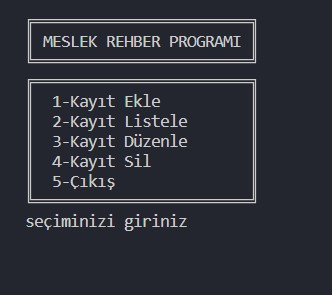
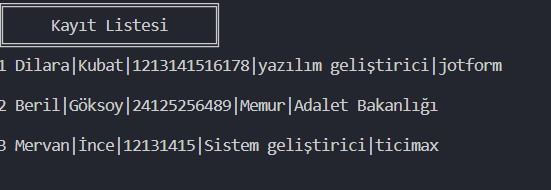
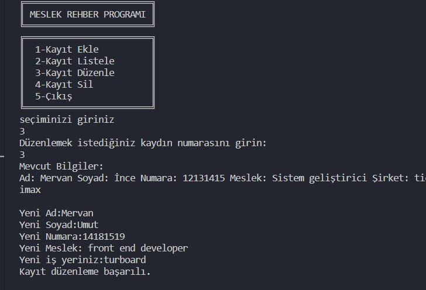

# PYTHON İLE GELİŞTİRİLMİŞ REHBER UYGUALAMASI
<h3> Bu Projede py uzantılı bir dosyaya veri ekleme,veri silme,
veri güncelleme ve verileri listelemek için dosya metodlarını kullandım.
* Proje python projesidir.
* Dosyadaki kodlara erişim engellemek ve kullanıcının daha iyi anlayabilmesi için dosya .exe uzantılı yapıldı.(pip install pyinstaller)(pyinstaller --onefile -w exeyecevrilecekdosyaadi.py)</h3>
<h3> Bu proje ile ilgili detaylı incelemeye aşağıdaki görsellerden bakabilirsiniz.<h3>

